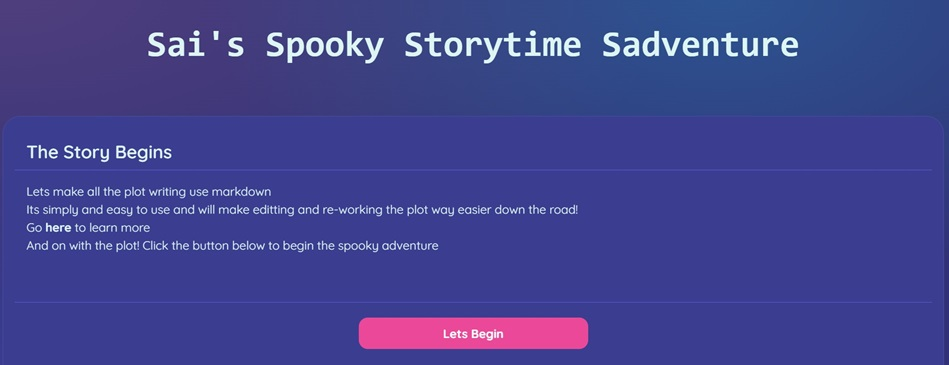

# NORLINS aka the Spooky Choose Yourown
  

## TABLE OF CONTENTS:

* [Description](#description)

* [Tools](#tools) 

* [Questions](#questions)

* [Credits](#credit)

* [License](#license)

## DESCRIPTION:

This is the ReadMe for Matty Lawhorn's project titled: NORLINS aka the Spooky Choose Yourown

Made a quick visual representation of Sai's spooky chose your own adventure

## TOOLS:

This project was made with [SvelteKit](https://kit.svelte.dev/) and used [SkeletonUI](https://www.skeleton.dev/)  
Markdown parsing is done with [Markdown-It](https://github.com/markdown-it/markdown-it)

## QUESTIONS:

If you have any questions,  
you can find my GitHub here: https://github.com/Lawhornmatt  
or email me here: fake@notreal.com

## CREDIT:

This project was made in 2024 by Matty Lawhorn in collaboration with Jena Heroman & Sai  
Big thank you to [this](https://joshcollinsworth.com/blog/build-static-sveltekit-markdown-blog) blog
by John Collins Worth which really helped me understand how to dynamically load markdown files in SvelteKit

## LICENSE:

This program is copyrighted under the MIT open source license.

Copyright 2024 Matty Lawhorn

    Permission is hereby granted, free of charge, to any person obtaining a copy of this software and associated documentation files (the "Software"), to deal in the Software without restriction, including without limitation the rights to use, copy, modify, merge, publish, distribute, sublicense, and/or sell copies of the Software, and to permit persons to whom the Software is furnished to do so, subject to the following conditions:
    
    The above copyright notice and this permission notice shall be included in all copies or substantial portions of the Software.
    
    THE SOFTWARE IS PROVIDED "AS IS", WITHOUT WARRANTY OF ANY KIND, EXPRESS OR IMPLIED, INCLUDING BUT NOT LIMITED TO THE WARRANTIES OF MERCHANTABILITY, FITNESS FOR A PARTICULAR PURPOSE AND NONINFRINGEMENT. IN NO EVENT SHALL THE AUTHORS OR COPYRIGHT HOLDERS BE LIABLE FOR ANY CLAIM, DAMAGES OR OTHER LIABILITY, WHETHER IN AN ACTION OF CONTRACT, TORT OR OTHERWISE, ARISING FROM, OUT OF OR IN CONNECTION WITH THE SOFTWARE OR THE USE OR OTHER DEALINGS IN THE SOFTWARE.

[Further license information can be found here.](https://opensource.org/licenses/MIT)